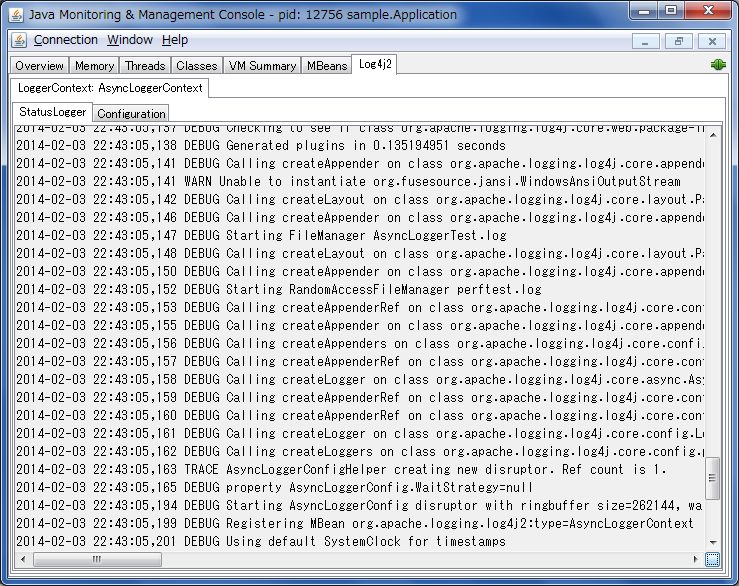
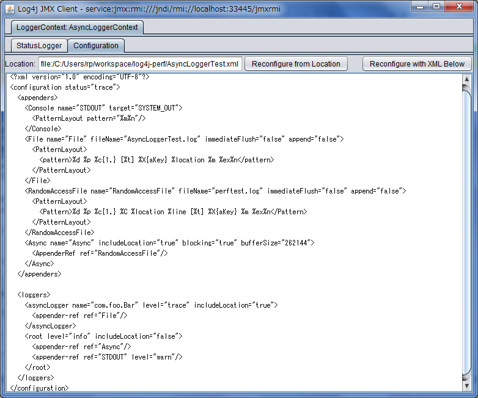

////
Licensed to the Apache Software Foundation (ASF) under one or more
contributor license agreements. See the NOTICE file distributed with
this work for additional information regarding copyright ownership.
The ASF licenses this file to You under the Apache License, Version 2.0
(the "License"); you may not use this file except in compliance with
the License. You may obtain a copy of the License at

    https://www.apache.org/licenses/LICENSE-2.0

Unless required by applicable law or agreed to in writing, software
distributed under the License is distributed on an "AS IS" BASIS,
WITHOUT WARRANTIES OR CONDITIONS OF ANY KIND, either express or implied.
See the License for the specific language governing permissions and
limitations under the License.
////

:project-version: 2.21.0
:log4j-version: 2.20.0
:log4j-jmx-doc-url: https://logging.apache.org/log4j/2.x/manual/jmx.html
:oracle-remote-monitoring-doc-url: https://docs.oracle.com/javase/8/docs/technotes/guides/management/agent.html#gdenl

Log4j has built-in support for JMX.
The `StatusLogger`, `ContextSelector`, and all ``LoggerContext``s, ``LoggerConfig``s and ``Appender``s are instrumented with MBeans and can be remotely monitored and controlled.
See the {log4j-jmx-doc-url}[Log4j JMX support documentation] on how to configure it.

The Log4j JMX GUI provides a Swing-based client for remotely editing the Log4j configuration and remotely monitoring `StatusLogger` output.
It can be run as a standalone application or as a JConsole plugin.

[#jconsole-run]
== Running the client as a JConsole plugin

To run the Log4j JMX GUI as a JConsole plugin, start JConsole with the following command:

[source,bash,subs="attributes"]
----
$JAVA_HOME/bin/jconsole -pluginpath /path/to/log4j-api-{log4j-version}.jar:/path/to/log4j-core-{log4j-version}.jar:/path/to/log4j-jmx-gui-{project-version}.jar
----

or on Windows:

[source,bash,subs="attributes"]
----
%JAVA_HOME%\bin\jconsole -pluginpath \path\to\log4j-api-{log4j-version}.jar;\path\to\log4j-core-{log4j-version}.jar;\path\to\log4j-jmx-gui-{project-version}.jar
----

If you execute the above command and connect to your application, you will see an extra `Log4j 2` tab in the JConsole window.
This tab contains the client GUI, with the `StatusLogger` selected.
The screenshot below shows the `StatusLogger` panel in JConsole.

[#jconsole-edit]
== Remotely editing the Log4j configuration

The client GUI also contains a simple editor that can be used to remotely change the Log4j configuration.
The screenshot below shows the configuration edit panel in JConsole.

image::jmx-jconsole-editconfig.png[]

The configuration edit panel provides two ways to modify the Log4j configuration: specifying a different configuration location URI, or modifying the configuration XML directly in the editor panel.

If you specify a different configuration location URI and click the _"Reconfigure from Location"_ button, the specified file or resource must exist and be readable by the application, or an error will occur and the configuration will not change.
If an error occurred while processing the contents of the specified resource, Log4j will keep its original configuration, but the editor panel will show the contents of the file you specified.

The text area showing the contents of the configuration file is editable, and you can directly modify the configuration in this editor panel.
Clicking the _"Reconfigure with XML below"_ button will send the configuration text to the remote application where it will be used to reconfigure Log4j on the fly.
This will not overwrite any configuration file.
Reconfiguring with text from the editor happens in memory only and the text is not permanently stored anywhere.

[#standalone-run]
== Running the client as a standalone application

To run the Log4j JMX GUI as a standalone application, run the following command:

[source,bash,subs="attributes"]
----
$JAVA_HOME/bin/java -cp /path/to/log4j-api-{log4j-version}.jar:/path/to/log4j-core-{log4j-version}.jar:/path/to/log4j-jmx-gui-{project-version}.jar org.apache.logging.log4j.jmx.gui.ClientGui <options>
----

or on Windows:

[source,bash,subs="attributes"]
----
%JAVA_HOME%\bin\java -cp \path\to\log4j-api-{log4j-version}.jar;\path\to\log4j-core-{log4j-version}.jar;\path\to\log4j-jmx-gui-{log4j-version}.jar org.apache.logging.log4j.jmx.gui.ClientGui <options>
----

Where options are one of the following:

- `<host>:<port>`
- `service:jmx:rmi:///jndi/rmi://<host>:<port>/jmxrmi`
- `service:jmx:rmi://<host>:<port>/jndi/rmi://<host>:<port>/jmxrmi`

[IMPORTANT]
====
The port number (i.e., `port`) must be the same as the `com.sun.management.jmxremote.port` configured for the application you want to monitor.
====

For example, if you started your application with these options:

[source,properties]
----
com.sun.management.jmxremote.port=33445
com.sun.management.jmxremote.authenticate=false
com.sun.management.jmxremote.ssl=false
----

[WARNING]
====
Note that this disables all security so this is not recommended for production environments!
Oracle's documentation on {oracle-remote-monitoring-doc-url}[Remote Monitoring and Management] provides details on how to configure JMX more securely with password authentication and SSL.
====

Then you can run the client with this command:

[source,bash,subs="attributes"]
----
$JAVA_HOME/bin/java -cp /path/to/log4j-api-{log4j-version}.jar:/path/to/log4j-core-{log4j-version}.jar:/path/to/log4j-jmx-gui-{project-version}.jar org.apache.logging.log4j.jmx.gui.ClientGui localhost:33445
----

or on Windows:

[source,bash,subs="attributes"]
----
%JAVA_HOME%\bin\java -cp \path\to\log4j-api-{log4j-version}.jar;\path\to\log4j-core-{log4j-version}.jar;\path\to\log4j-jmx-gui-{log4j-version}.jar org.apache.logging.log4j.jmx.gui.ClientGui localhost:33445
----

The screenshot below shows the `StatusLogger` panel of the client GUI when running as a standalone application.

image::jmx-standalone-statuslogger.png[]

The screenshot below shows the configuration editor panel of the client GUI when running as a standalone application.

